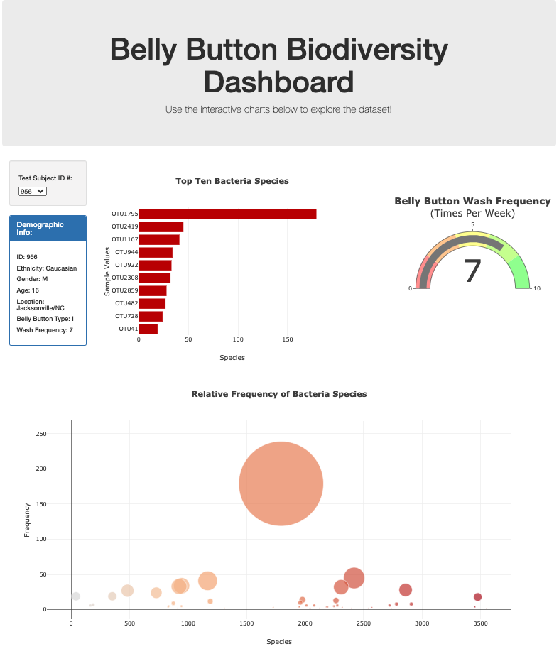

# Belly Button Biodiversity

UC Berkeley Extension Data Analytics Boot Camp Module 12

---

View the dashboard on my [GitHub.io Website](https://sathvikaithala.github.io/Belly_Button_Diversity/)!

---

### Objective:

In this module, we were tasked with creating a dashboard that displays information about the top ten bacteria species in a person's belly button, along with other information related to that individual. 

---

### Overview:

The user is able to select one of the many ID numbers in the dropdown list to view their associated belly button bacteria makeup.

The page will load three charts, as well as a table that displays demographic data for the selected ID number. 

- The bar chart will display the top ten bacteria species, and the amount of each that is present within the sample.

- The gauge chart will show the frequency of belly button washings the sample reported, ranging from 0 to 9 washes per week.

- The bubble plot displays the relative frequency of each bacterial species found in the belly button. 

---

### Sample:

Here is an example of the dashboard, showing the results for ID #956.

